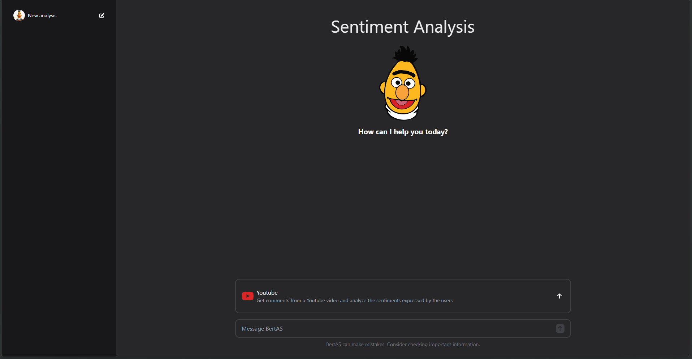
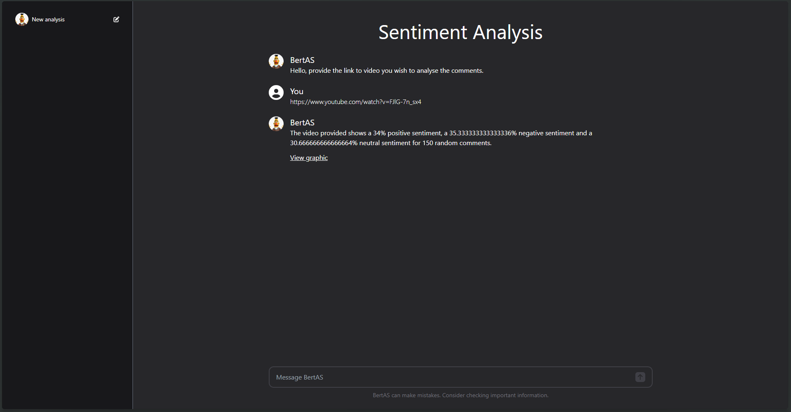
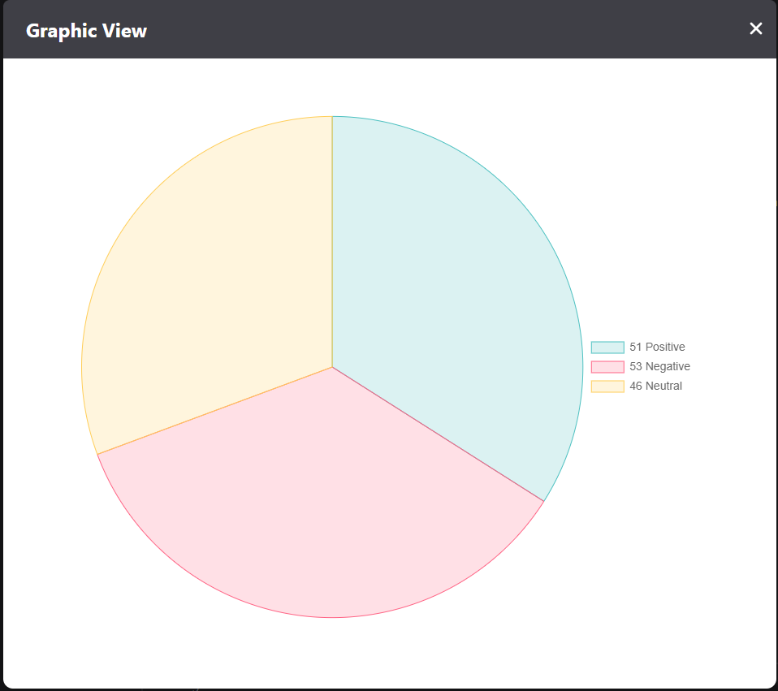

# Proyecto de Análisis de Sentimientos en Redes Sociales usando IA

## Descripción del Proyecto

Este proyecto consiste en desarrollar un sistema de análisis de sentimientos en redes sociales utilizando técnicas de inteligencia artificial (IA). El sistema recopila datos de redes sociales, analiza el texto para determinar el sentimiento (positivo, negativo o neutro) y proporciona estadísticas y visualizaciones sobre el estado de ánimo de los usuarios en relación con temas específicos o tendencias actuales.

## Estructura del Proyecto

### Frontend
- **Framework:** Next.js
- **Estilos:** Tailwind CSS

### Backend
- **Framework para API:** Next.js
- **IA:** Python

## Funcionalidades Principales
1. **Recopilación de Datos de Redes Sociales**
   - API para la recolección de datos (comentarios) a través de YouTube.

2. **Análisis de Sentimientos**
   - Utilizar algoritmos de procesamiento de lenguaje natural (NLP) para analizar textos de publicaciones y determinar el sentimiento.
   - Utilizar un modelo de IA previamente entrenado para reconocer sentimientos positivos, negativos y neutros.

3. **Generación de Estadísticas y Visualizaciones**
   - Calcular estadísticas sobre el sentimiento general de los usuarios en relación con temas específicos.
   - Crear visualizaciones como gráficos de barras y mapas de calor para mostrar la distribución del sentimiento.

4. **Interfaz de Usuario**
   - Diseñar una interfaz de usuario intuitiva que permita interactuar con el sistema y explorar los resultados del análisis de sentimientos.
   - Proporcionar funcionalidades adicionales como búsqueda de temas específicos, comparación de tendencias y segmentación de datos.

## Instalación

### Pre-requisitos
- Node.js
- Python 3.x
- pip

### Pasos
1. Clonar el repositorio:
   ```sh
   git clone https://github.com/fernandolopez2171/proyecto-analisis-sentimientos.git
   cd proyecto-analisis-sentimientos
   ```

2. Instalar dependencias del frontend:
   ```sh
   cd Frontend
   npm install
   ```

3. Instalar dependencias del backend:
   ```sh
   cd Backend
   pip install -r requirements.txt
   ```

## Uso

### Frontend
1. Iniciar el servidor de desarrollo:
   ```sh
   cd Frontend
   npm run dev
   ```
2. Acceder a `http://localhost:3000` en tu navegador.

### Backend
1. Ejecutar el backend de la IA:
   ```sh
   cd Backend
   cd BertModel
   python app.py
   ```

## Review






